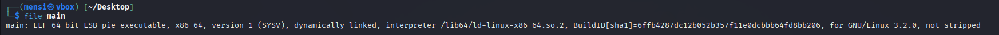
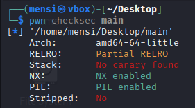
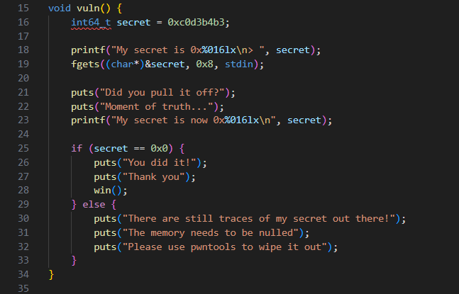

# baby_pwntools - writeup

## description


# binary information

```
$ file main
```



```
$ pwn checksec main
```



## solution

This task is pretty straightforward all we have to do is use `pwntools` python librayr which is a library designed for exploit development.
We should change the value of the local variable `secret` with `0x0` and we will get the flag.


