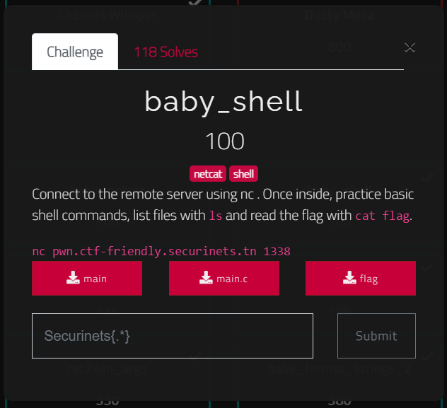
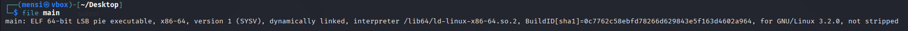
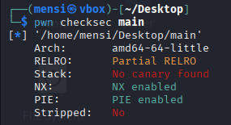
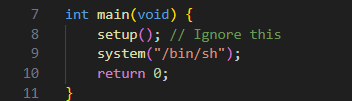

# baby_overflow - writeup

## description



## binary information

```
$ file main
```



```
$ pwn checksec main
```



## Solution

In this task we are given a binary that spawn a shell and using `cat flag` we can solve the task and get our flag.


