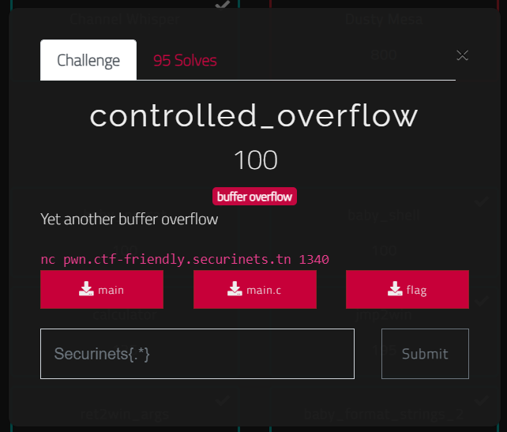

# controlled_overflow - writeup

## description



## binary information

```
$ file main
```


```
$ pwn checksec main
```


## solution

In this task we should exploit the buffer overflow vulnerability to overwrite the value of the local variable `key` with `0x3030303030303030` in order the get the flag.
